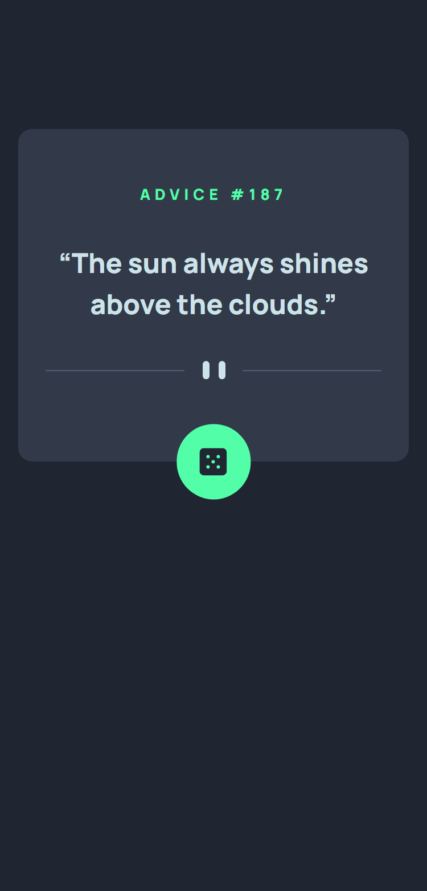
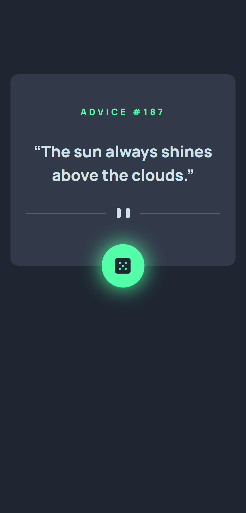
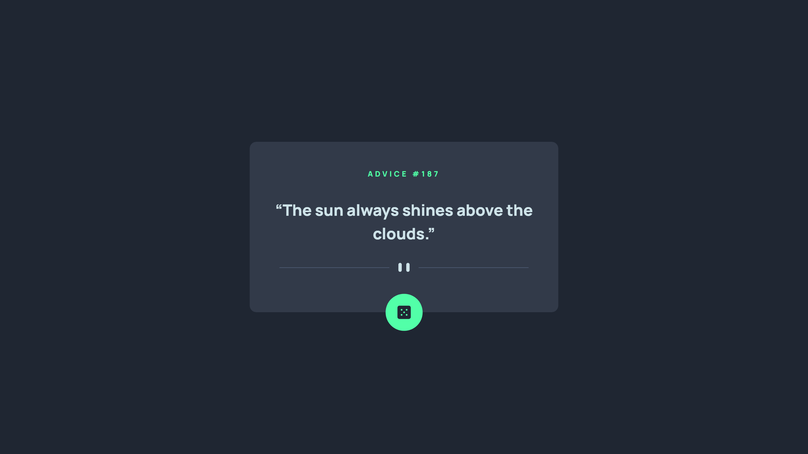
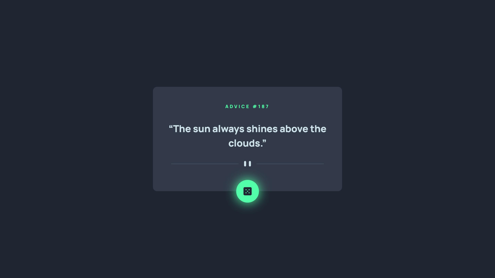

# Frontend Mentor - Advice generator app solution

This is a solution to the [Advice generator app challenge on Frontend Mentor](https://www.frontendmentor.io/challenges/advice-generator-app-QdUG-13db). Frontend Mentor challenges help you improve your coding skills by building realistic projects.

## Table of contents

- [Overview](#overview)
  - [The challenge](#the-challenge)
  - [Screenshot](#screenshot)
  - [Links](#links)
- [My process](#my-process)
  - [Built with](#built-with)
  - [What I learned](#what-i-learned)
  - [Continued development](#continued-development)
- [Author](#author)

## Overview

This is the fourth challenge in the **JavaScript Fundamentals Frontend Mentor Roadmap**.

It's the first challenge on Frontend Mentor where I had to work with API's. the challenge showcase the power of using third party API's to build out web applications.

### The challenge

Users should be able to:

- View the optimal layout for the app depending on their device's screen size
- See hover states for all interactive elements on the page
- Generate a new piece of advice by clicking the dice icon

### Screenshot

#### Mobile

##### Normal View

##### Interactive View

#### Desktop

##### Normal View

##### Interactive View

### Links

- Solution URL: [Add solution URL here](https://your-solution-url.com)
- Live Site URL: [Add live site URL here](https://your-live-site-url.com)

## My process

### Built with

- Semantic HTML5 markup
- CSS custom properties
- CSS Grid
- Mobile-first workflow
- Vanilla JS

### What I learned

Communicating with third party API's in this case **[Advice Slip Json API](https://api.adviceslip.com/)**.

I used `fetch()` method as it's the most modern and versatile. to load a random advice on page load and every time the user click the dice button. with some little DOM manipulation to update the display.

Communicating with API's also requires understanding of *promises* and the *async/await* keywords.

### Continued development

I'd like to practice with more API's in the future. as they do some heavy lifting and allow you to build out awesome stuff faster.

## Author

- Frontend Mentor - [@ilyesab](https://www.frontendmentor.io/profile/ilyesab)

